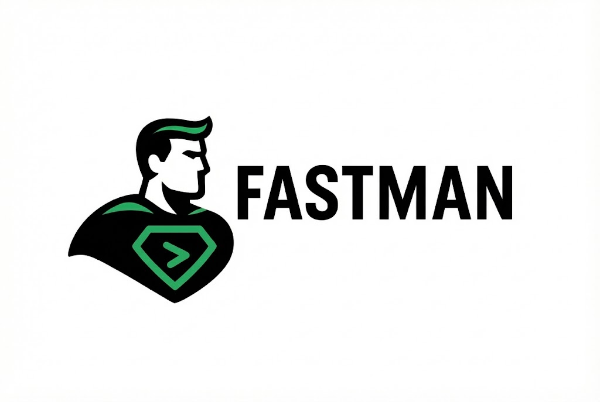

<div align="center">



# Fastman

### The Complete FastAPI CLI Framework

[](https://www.python.org/downloads/)
[](LICENSE)
[](https://github.com/astral-sh/ruff)
[](https://github.com/acathon/fastman-cli)

**Laravel-inspired CLI for FastAPI. Eliminate boilerplate. Ship faster.**

[Installation](#installation) • [Quick Start](#quick-start) • [Documentation](https://acathon.github.io/fastman-cli) • [Contributing](#contributing)

</div>

---

## ✨ Why Fastman?

Building FastAPI applications shouldn't be tedious. Fastman brings the **developer experience of Laravel** to the FastAPI ecosystem, eliminating boilerplate fatigue and letting you focus on what matters: building great APIs.

### 🚀 What Makes Fastman Different?

- **🏗️ Batteries Included** - Rich, Pyfiglet, IPython, and certifi are available out of the box
- **📦 Smart Package Detection** - Auto-detects `uv`, `poetry`, `pipenv`, or `pip`
- **🎨 Multiple Architectures** - Feature-based, API-focused, or Layered patterns
- **⚡ Lightning Fast** - Professional console UI with progress indicators
- **🔒 Security First** - Path traversal protection, input validation, secret generation
- **🐚 Shell Completions** - Bash, Zsh, Fish, PowerShell support
- **🗄️ Database Ready** - SQLite, PostgreSQL, MySQL, Oracle, Firebase support

---

## 📦 Installation

### From PyPI (Recommended)

```bash
pip install fastman
```

### From Source

```bash
git clone https://github.com/acathon/fastman-cli.git
cd fastman-cli
pip install -e .
```

### With uv (Fastest)

```bash
uv tool install fastman
```

---

## 🚀 Quick Start

### Create Your First Project

```bash
# Create a new FastAPI project
fastman create my-api --pattern=feature --database=sqlite

# Navigate to project
cd my-api

# Activate virtual environment
fastman activate  # Shows the correct command for your OS/shell

# Start development server
fastman serve
```

### Generate Your First Feature

```bash
# Create a complete CRUD feature with one command
fastman make:feature users --crud

# This generates:
# - app/features/users/models.py      (SQLAlchemy model)
# - app/features/users/schemas.py     (Pydantic schemas)
# - app/features/users/service.py     (Business logic)
# - app/features/users/router.py      (CRUD endpoints)
```

### Database Migrations Made Easy

```bash
# Create migration
fastman make:migration "create users table"

# Run migrations
fastman migrate

# Rollback if needed
fastman migrate:rollback --steps=1
```

---

## 🎨 Architecture Patterns

Fastman supports multiple architectural approaches to fit your project's needs:

### Feature Pattern (Default) 🎯
Vertical slice architecture where everything related to a feature is in one place.

```
app/
├── features/
│   ├── users/          # Everything about users
│   │   ├── models.py
│   │   ├── schemas.py
│   │   ├── service.py
│   │   └── router.py
│   └── orders/         # Everything about orders
├── core/               # Shared infrastructure
└── api/                # Lightweight endpoints
```

### API Pattern 🌐
Traditional API-focused structure with clear separation.

```
app/
├── api/                # API routes
├── schemas/            # Pydantic schemas
├── models/             # Database models
└── core/
```

### Layer Pattern 🥞
Layered architecture with clear responsibilities.

```
app/
├── controllers/        # Request handlers
├── services/          # Business logic
├── repositories/      # Data access
├── models/            # Database models
└── schemas/           # Pydantic schemas
```

---

## 🐚 Shell Completions

Fastman includes intelligent shell completions for all major shells:

```bash
# Bash
fastman completion bash --install

# Zsh
fastman completion zsh --install

# Fish
fastman completion fish --install

# PowerShell
fastman completion powershell --install
```

**Features:**
- ✅ Command name completion
- ✅ Option completion
- ✅ Value suggestions (e.g., `--database=sqlite|postgresql|mysql`)
- ✅ Context-aware completions

---

## 📚 Command Reference

### Project Commands

| Command | Description | Example |
|---------|-------------|---------|
| `fastman create` | Create new FastAPI project | `fastman create my-api --pattern=feature` |
| `fastman init` | Initialize Fastman in existing project | `fastman init` |
| `fastman activate` | Show venv activation command | `fastman activate` |

### Development Commands

| Command | Description | Example |
|---------|-------------|---------|
| `fastman serve` | Start development server | `fastman serve --env=development` |
| `fastman tinker` | Interactive shell with DB session | `fastman tinker` |
| `fastman route:list` | List all API routes | `fastman route:list --method=GET` |

### Scaffolding Commands

| Command | Description | Example |
|---------|-------------|---------|
| `fastman make:feature` | Create vertical slice feature | `fastman make:feature orders --crud` |
| `fastman make:model` | Create SQLAlchemy model | `fastman make:model User --table=users` |
| `fastman make:api` | Create API endpoint | `fastman make:api products --style=rest` |
| `fastman make:middleware` | Create middleware | `fastman make:middleware Auth` |

### Database Commands

| Command | Description | Example |
|---------|-------------|---------|
| `fastman make:migration` | Create Alembic migration | `fastman make:migration "add users"` |
| `fastman migrate` | Run migrations | `fastman migrate` |
| `fastman migrate:rollback` | Rollback migrations | `fastman migrate:rollback --steps=1` |
| `fastman db:seed` | Run database seeders | `fastman db:seed --class=UserSeeder` |

### Third-Party Integrations

| Command | Description | Example |
|---------|-------------|---------|
| `fastman install:auth` | Install JWT, OAuth, Keycloak, or Passkey auth | `fastman install:auth --type=keycloak --append-certificate` |
| `fastman install:certificate` | Append project certificates to the certifi CA bundle | `fastman install:certificate` |

### Utilities

| Command | Description | Example |
|---------|-------------|---------|
| `fastman config:appkey` | Generate secret key | `fastman config:appkey` |
| `fastman optimize` | Optimize code (ruff lint & format) | `fastman optimize` |
| `fastman build --docker` | Generate Dockerfile | `fastman build --docker` |

---

## 🎯 Advanced Features

### Interactive Shell (`tinker`)

Explore your application with an interactive Python shell:

```bash
$ fastman tinker

Fastman Interactive Shell
Available: settings, SessionLocal, Base, db

>>> from app.features.users.models import User
>>> user = db.query(User).first()
>>> print(user.email)
user@example.com
```

### Smart Package Manager Detection

Fastman automatically detects and uses your preferred package manager:

1. **uv** (fastest, recommended) - Detected by `uv.lock`
2. **Poetry** - Detected by `poetry.lock`
3. **Pipenv** - Detected by `Pipfile`
4. **pip** - Fallback, creates `requirements.txt`

### Professional Console UI

Fastman features a modern console interface with:
- 🎨 Rich color schemes (with fallback to ANSI)
- ⏳ Progress indicators for long operations
- 📊 Professional tables for data display
- ✅ Clear success/error messaging
- 🖼️ Beautiful ASCII/figlet banners

---

## 🏗️ Tutorial: Build a Pizza Order API

Let's build a complete pizza ordering system to see Fastman in action.

### Step 1: Create Project

```bash
fastman create pizza-api --pattern=feature --package=uv --database=sqlite
cd pizza-api
```

### Step 2: Create Orders Feature

```bash
fastman make:feature orders --crud
```

### Step 3: Define the Model

Edit `app/features/orders/models.py`:

```python
from sqlalchemy import Column, Integer, String, DateTime, Float
from sqlalchemy.sql import func
from app.core.database import Base

class Order(Base):
    __tablename__ = "orders"
    
    id = Column(Integer, primary_key=True, index=True)
    customer_name = Column(String(255), nullable=False)
    pizza_type = Column(String(100), nullable=False)
    quantity = Column(Integer, default=1)
    price = Column(Float, nullable=False)
    status = Column(String(50), default="pending")
    created_at = Column(DateTime(timezone=True), server_default=func.now())
    updated_at = Column(DateTime(timezone=True), onupdate=func.now())
```

### Step 4: Create Migration

```bash
fastman make:migration "create orders table"
fastman migrate
```

### Step 5: Start Server

```bash
fastman serve
```

Visit `http://127.0.0.1:8000/docs` to see your API documentation!

---

## 🧪 Testing

Fastman includes comprehensive test suites:

```bash
# Run all tests
pytest tests/

# Run with coverage
pytest tests/ --cov=fastman

# Run specific test file
pytest tests/test_integration.py
```

---

## 🤝 Contributing

We welcome contributions! Please see our [Contributing Guide](CONTRIBUTING.md) for details.

### Development Setup

```bash
git clone https://github.com/acathon/fastman-cli.git
cd fastman-cli

# Install in editable mode
pip install -e ".[dev]"

# Run tests
pytest

# Lint and format
ruff check src/ --fix
ruff format src/
```

---

## 📄 License

Fastman is open-source software licensed under the [MIT license](LICENSE).

---

## 🙏 Acknowledgments

- Inspired by [Laravel Artisan](https://laravel.com/docs/artisan) - The gold standard for CLI frameworks
- Built on [FastAPI](https://fastapi.tiangolo.com/) - The modern, fast web framework
- Powered by [Typer](https://typer.tiangolo.com/) and [Click](https://click.palletsprojects.com/) concepts

---

<div align="center">

**Made with ❤️ by the Fastman Team**

[⭐ Star us on GitHub](https://github.com/acathon/fastman-cli) • [🐛 Report Bug](https://github.com/acathon/fastman-cli/issues) • [💡 Request Feature](https://github.com/acathon/fastman-cli/issues)

</div>
